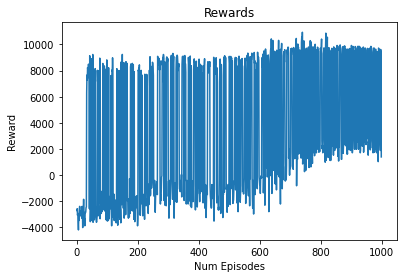

# A3C_Multi-Agent_Highway_Simulation
Multi-agent reinforcement learning using A3C in a simulated highway roundabout environment with cryptographic integrity checks

```markdown
# A3C Multi-Agent Highway Simulation

## Overview
This project implements an Advantage Actor-Critic (A3C) algorithm for a multi-agent environment using a highway roundabout simulation. The implementation focuses on reinforcement learning with a TensorFlow backend to train agents to navigate in a complex roundabout environment.

## Features
- **A3C Algorithm**: Implementation of the Advantage Actor-Critic (A3C) algorithm for multi-agent training.
- **Highway Environment**: Simulates a roundabout environment where multiple agents interact.
- **System Integrity Check**: - **Simulated Roundabout**: Simulates a roundabout environment for testing multi-agent interaction and behavior.

## Project Structure
- `A3C.PY`: The main file implementing the A3C algorithm, including the environment setup, model definition, and training loop.
- `A3C_test.py`: A simple test script to evaluate the trained model by running it in the environment and outputting the total reward per episode.
- `A3C_test_limit25.py`: A modified version of `A3C_test.py` that stops the test if the score reaches 25 points.


## Installation
1. Clone this repository:
    ```bash
    git clone https://github.com/yourusername/A3C-Multi-Agent-Highway-Simulation.git
    ```
2. Install the required dependencies:
    ```bash
    pip install -r requirements.txt
    ```

## Usage
### Training the Model
To train the model using the A3C algorithm:
```bash
python A3C.PY
```

### Testing the Model
To test the model on the environment and observe the rewards:
```bash
python A3C_test.py
```

### Testing
For testing functions and verifying system integrity:
```bash
python A3C_test_limit25.py
```

## 成果展示




## Dependencies
- TensorFlow
- Gymnasium
- Highway-Env
- NumPy
- Matplotlib

## Contributing
Contributions are welcome! Please open an issue or submit a pull request.

### 檔案說明
For testing cryptographic functions and verifying system integrity:
```bash
python A3C_test.py為訓練權重檔程式
python A3C_test_limit25.py 為測試權重檔程式(分數跑到25會自動停止)
python A3C_test.py 為測試權重檔程式(分數無上限)
a3c_250_weights.h5 為訓練250次權重檔
```
